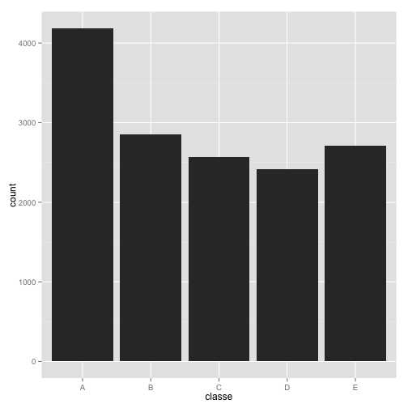

#Practical Machine Learning Course Project

##Overview

This report is a part of analysis which is the requirement of Practical Machine Learning course offered by Coursera. Below is the background and detail on data copied from the course project page.

###Background
Using devices such as Jawbone Up, Nike FuelBand, and Fitbit it is now possible to collect a large amount of data about personal activity relatively inexpensively. These type of devices are part of the quantified self movement – a group of enthusiasts who take measurements about themselves regularly to improve their health, to find patterns in their behavior, or because they are tech geeks. One thing that people regularly do is quantify how much of a particular activity they do, but they rarely quantify how well they do it. In this project, your goal will be to use data from accelerometers on the belt, forearm, arm, and dumbell of 6 participants. They were asked to perform barbell lifts correctly and incorrectly in 5 different ways. More information is available from the website here: http://groupware.les.inf.puc-rio.br/har (see the section on the Weight Lifting Exercise Dataset).

###Data
The training data for this project are available here: 

https://d396qusza40orc.cloudfront.net/predmachlearn/pml-training.csv

The test data are available here: 

https://d396qusza40orc.cloudfront.net/predmachlearn/pml-testing.csv

##System requirements
This analysis was performed using R version 3.1.1 on Mac OS X Mavericks. Below is the detail of environment from R session.


```r
sessionInfo()
```

```
## R version 3.1.1 (2014-07-10)
## Platform: x86_64-apple-darwin13.1.0 (64-bit)
## 
## locale:
## [1] en_US.UTF-8/en_US.UTF-8/en_US.UTF-8/C/en_US.UTF-8/en_US.UTF-8
## 
## attached base packages:
## [1] stats     graphics  grDevices utils     datasets  methods   base     
## 
## other attached packages:
## [1] knitr_1.6
## 
## loaded via a namespace (and not attached):
## [1] evaluate_0.5.5 formatR_1.0    stringr_0.6.2  tools_3.1.1
```

##Package requirements

The following packages are used for this project and need to be installed before running the analysis;

1. **caret**
2. **randomForest** - Random forest for classification and regression
3. **rpart** - Regressive Partitioning and Regression trees

Load the packages using the following commands;


```r
library(caret)
library(randomForest)
library(rpart) 
```

##Preprocessing

We start with setting a seed for reproduceability.


```r
set.seed(115)
```

First we load the data sets into R and make sure that missing values are coded correctly. Observing the files, it was found that some missing values are coded as string "#DIV/0!" or "" or "NA" and these will be changed to NA.  


```r
training <- read.csv("pml-training.csv", na.strings=c("NA","#DIV/0!", ""))

testing <- read.csv("pml-testing.csv", na.strings=c("NA","#DIV/0!", ""))
```

Let us check the dimensions of both of the datasets

```r
dim(training)
```

```
## [1] 19622   160
```

```r
dim(testing)
```

```
## [1]  20 160
```

We notice that both data sets contain columns with all missing values. We remove them.

```r
training <- training[,colSums(is.na(training)) == 0]
testing <- testing[,colSums(is.na(testing)) == 0]
```

We also take into consideration only those variables that are relevant to this analysis. For instance, the first 7 variables looks irrelevant. Let's remove them as well.


```r
training  <- training[,-c(1:7)]
testing <- testing[,-c(1:7)]
```

Let's take a look at final datasets.


```r
dim(training)
```

```
## [1] 19622    53
```

```r
dim(testing)
```

```
## [1] 20 53
```

##Data partitioning

In order to perform cross-validation, the training data set is partionned into 2 sets: subTraining (75%) and subTest (25%). This will be performed using random subsampling without replacement.


```r
subsamples <- createDataPartition(y = training$classe, p = 0.75, list = FALSE)
subTraining <- training[subsamples, ] 
subTesting <- training[-subsamples, ]
```

Let's look at the 2 sets.


```r
dim(subTraining)
```

```
## [1] 14718    53
```

```r
dim(subTesting)
```

```
## [1] 4904   53
```

##Exploratory analysis of the data

The variable ***classe*** contains 5 levels: A, B, C, D and E. We now plot a histogram to see the frequency of each level.


```r
qplot(classe, data=subTraining, geom="histogram")
```

 

We can see that level A is the most frequent while level D is the least frequent.

##Prediction models

We will now analyse the data using 2 different prediction models. Based on the outcomes, we will decide which model to use for our submission project.

### Using Decision Tree


```r
modelTree <- rpart(classe ~ ., data=subTraining, method="class")

predictionTree <- predict(modelTree, subTesting, type = "class")
```


```r
confusionMatrix(predictionTree, subTesting$classe)
```

```
## Confusion Matrix and Statistics
## 
##           Reference
## Prediction    A    B    C    D    E
##          A 1234  144   10   28   16
##          B   48  543   79   64   71
##          C   39   99  687  140  128
##          D   51   72   48  496   40
##          E   23   91   31   76  646
## 
## Overall Statistics
##                                         
##                Accuracy : 0.735         
##                  95% CI : (0.723, 0.748)
##     No Information Rate : 0.284         
##     P-Value [Acc > NIR] : <2e-16        
##                                         
##                   Kappa : 0.665         
##  Mcnemar's Test P-Value : <2e-16        
## 
## Statistics by Class:
## 
##                      Class: A Class: B Class: C Class: D Class: E
## Sensitivity             0.885    0.572    0.804    0.617    0.717
## Specificity             0.944    0.934    0.900    0.949    0.945
## Pos Pred Value          0.862    0.675    0.629    0.702    0.745
## Neg Pred Value          0.954    0.901    0.956    0.927    0.937
## Prevalence              0.284    0.194    0.174    0.164    0.184
## Detection Rate          0.252    0.111    0.140    0.101    0.132
## Detection Prevalence    0.292    0.164    0.223    0.144    0.177
## Balanced Accuracy       0.914    0.753    0.852    0.783    0.831
```

###Using Random Forest


```r
modelForest <- randomForest(classe ~. , data=subTraining, method="class")

predictionForest <- predict(modelForest, subTesting, type = "class")

confusionMatrix(predictionForest, subTesting$classe)
```

```
## Confusion Matrix and Statistics
## 
##           Reference
## Prediction    A    B    C    D    E
##          A 1395    0    0    0    0
##          B    0  947    3    0    0
##          C    0    2  852   12    2
##          D    0    0    0  792    0
##          E    0    0    0    0  899
## 
## Overall Statistics
##                                         
##                Accuracy : 0.996         
##                  95% CI : (0.994, 0.998)
##     No Information Rate : 0.284         
##     P-Value [Acc > NIR] : <2e-16        
##                                         
##                   Kappa : 0.995         
##  Mcnemar's Test P-Value : NA            
## 
## Statistics by Class:
## 
##                      Class: A Class: B Class: C Class: D Class: E
## Sensitivity             1.000    0.998    0.996    0.985    0.998
## Specificity             1.000    0.999    0.996    1.000    1.000
## Pos Pred Value          1.000    0.997    0.982    1.000    1.000
## Neg Pred Value          1.000    0.999    0.999    0.997    1.000
## Prevalence              0.284    0.194    0.174    0.164    0.184
## Detection Rate          0.284    0.193    0.174    0.162    0.183
## Detection Prevalence    0.284    0.194    0.177    0.162    0.183
## Balanced Accuracy       1.000    0.999    0.996    0.993    0.999
```

We can see that the random forest algorithm is better than the decision tree with an accuray of 99%. We now use the prediction from random forest to generate the file for submission project.

## Submission


```r
finalPredict <- predict(modelForest, testing, type="class")
finalPredict
```

```
##  1  2  3  4  5  6  7  8  9 10 11 12 13 14 15 16 17 18 19 20 
##  B  A  B  A  A  E  D  B  A  A  B  C  B  A  E  E  A  B  B  B 
## Levels: A B C D E
```

The function to generate files for the submission project is provided as below;

```r
pml_write_files = function(x){
  n = length(x)
  for(i in 1:n){
    filename = paste0("problem_id_",i,".txt")
    write.table(x[i],file=filename,quote=FALSE,row.names=FALSE,col.names=FALSE)
  }
}
```

Call the above function with our final prediction value.


```r
pml_write_files(finalPredict)
```
